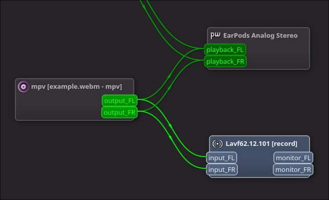

# Discord Linux Go-Live Audio Workaround Bot

This is a Discord bot that will allow you to stream application audio through it 
to a voice channel the exact same way those music bots do, and in Stereo.

For the longest time (5+ years) Discord didn't bother to capture Go-Live audio from Linux, during which I made this project. 
Now it does though, but unfortunately, it is mono, and it seems like it is downmixing it server side. 
Good news is, bots don't suffer from this issue, so this project is sticking around for probably 5 more years. 😞

The advantages of using this rather than routing through microphone input of Discord are that:
1. Discord mic input is encoded in mono, while bots can stream stereo audio. 
   Mono audio sounds terrible in almost every situation you would be using Go-Live.
2. You will need to give up noise suppression, etc. when doing it through the mic input.
3. Allow the end user audio level adjustment of the stream audio and your voice individually.
4. End users who don't want to listen to your stream can just mute the bot.

---

## Installation Instructions

1. Pick a .py file from this repo. Include `pulseaudio_source.py` too in the same directory.
    + `go-live-bot-classic.py` -- uses old style prefixed commands, scraping messages.
    + `go-live-bot-slash.py` -- uses slash commands.
    + `go-live-bot-pycord.py` -- uses slash commands but uses pycord library instead of discord.py.
2. Make sure the file is executable (`chmod +x go-live-bot-classic.py`)
3. Install discord.py 2.x with some dependencies: 
   + Arch Linux users can do `paru -S python-discord python-pynacl python-davey`
   + if you want to create a virtual environment, inside you do `pip3 install discord.py[voice] PyNaCl davey`
4. Make sure you have `ffmpeg` and `qpwgraph` installed as well.
5. Set `GOLIVE_BOT_TOKEN` environment variable with the bot token or put it in `~/.local/share/go-live-bot/token.txt`

To get a bot token, register a new app [here](https://discord.com/developers/applications), 
create a bot, and copy the token (not the client secret).  
You also need to enable `MESSAGE CONTENT` intent for the classic command version.

## How to use

1. Start the bot. (Literally run the script)
2. Type `gl.join` or `/join` inside the voice channel you want the bot to join.
    + This will make the bot join and start streaming your microphone.
3. Open `qpwgraph` and using it, disconnect ur microphone from your bot's capture (Lavf...) and connect your media player instead, as per this example.

4. When you are done, type `gl.leave` or `/leave` commands of the bot to get it to leave.

---
### Note:
Viewers who are using the web version of Discord (including third party clients) 
will hear the audio in mono. Mobile users too (not personally verified). Nothing I can do about this.

---

~~Its absolutely insane that the discord engineers who are paid $150k-$250k/yr+ cba to spend few hours to fix up the linux client.~~
Nevermind, [apparently this is gonna change now](https://www.youtube.com/watch?v=BwNfmazmU4o)